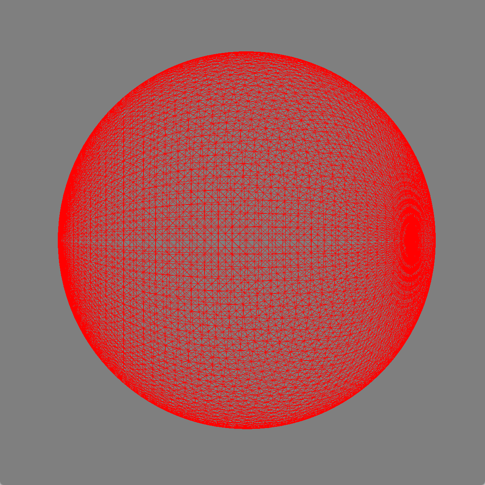
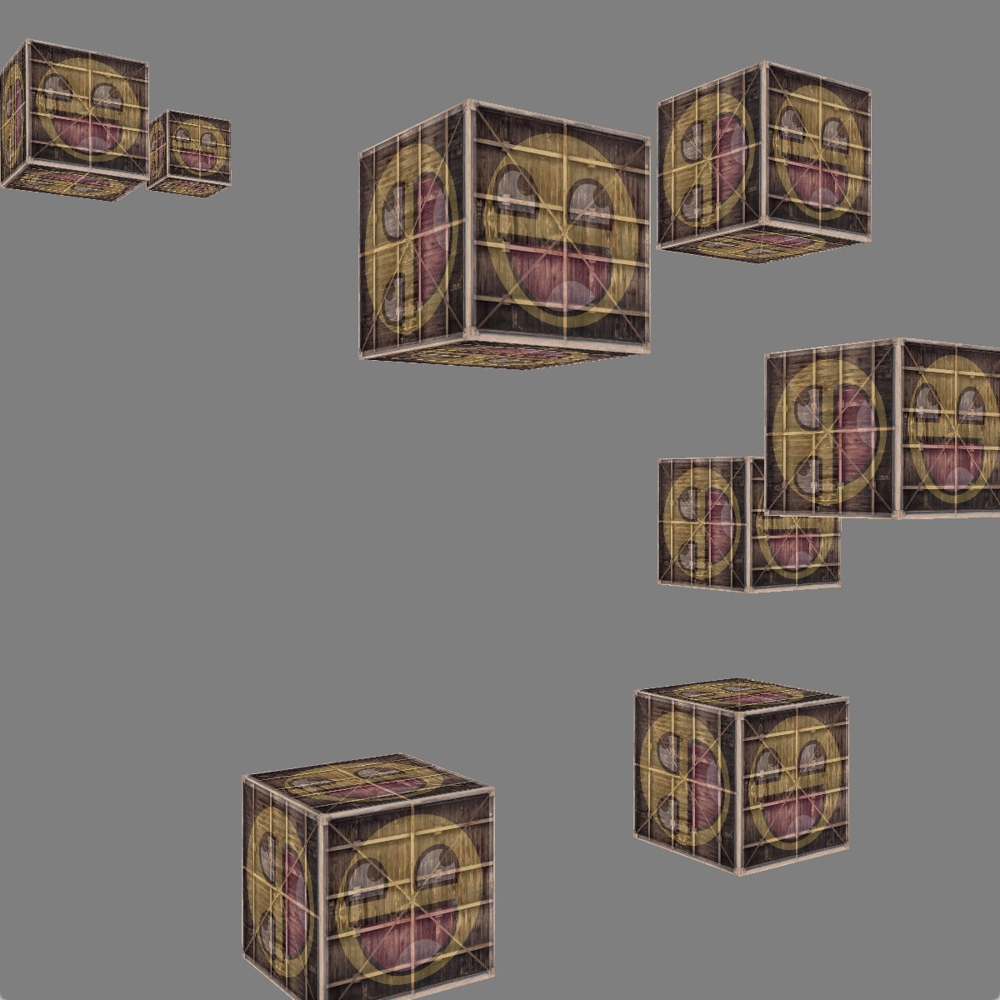
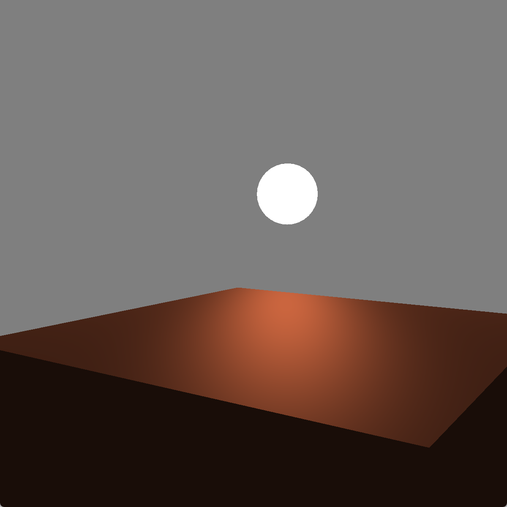
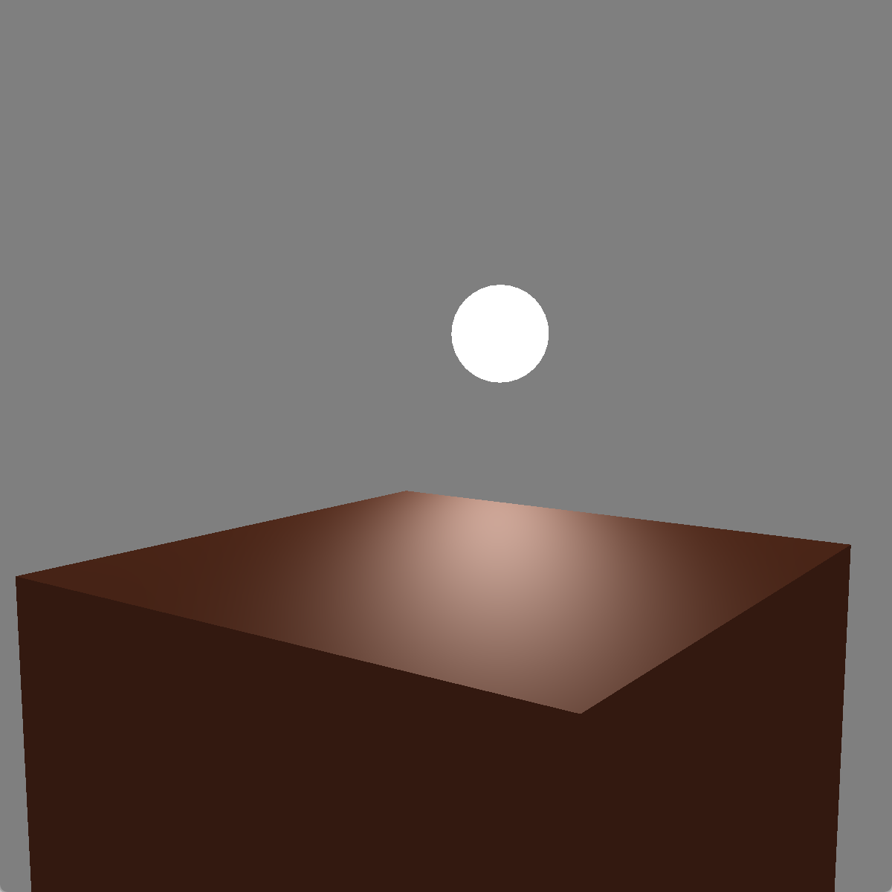

# opengl-rs
Enjoy opengl in Rust !!

| 描述               | 文件                               |
| ------------------ | ---------------------------------- |
| 立方体             | `examples/cubes.rs`                |
| 球体               | `examples/sphere.rs`               |
| 冯氏光照           | `examples/phone_light.rs`          |
| 带有材质的冯氏光照 | `examples/phone_light_material.rs` |

